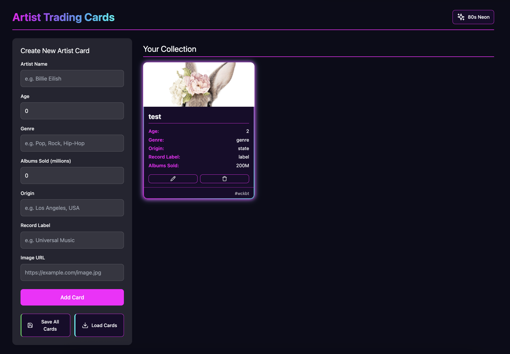
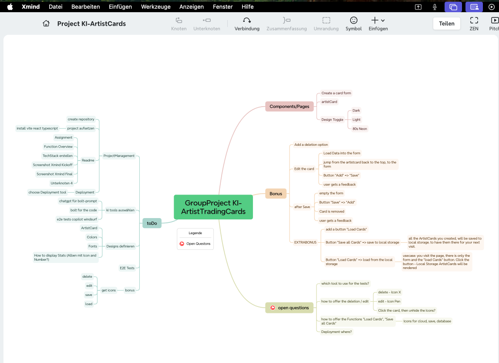
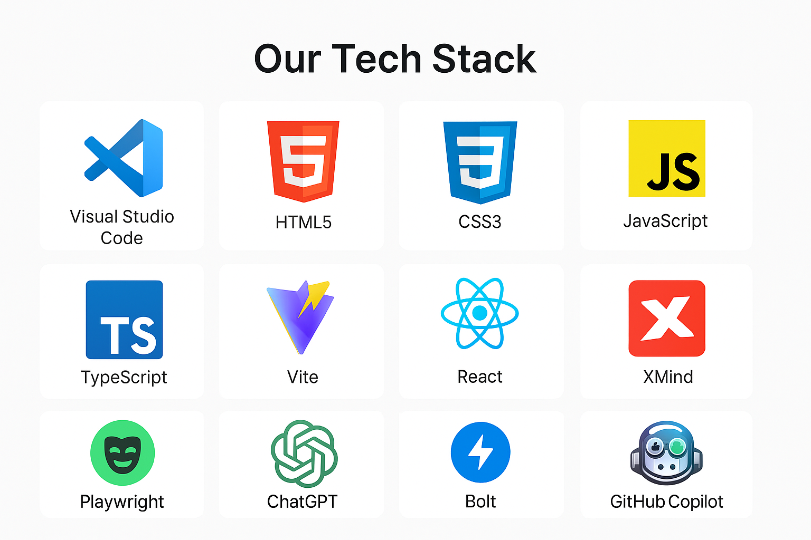

# GroupProjekt Artist Trading Cards

- 🍀Mona
- 🍀Mina
- 🍀Nina

__________
## OverView First Shot by Bolt

__________
## Assignment:

"Wir bauen eine kleine React-App, in der du Sammelkarten erstellen und anzeigen kannst – inspiriert von Panini-Karten oder Trading Cards.

Du entscheidest, welche Sammelkarten du erstellen willst – Fußballstars, Pokémon, Star Wars Charaktere, Rapper:innen, Autos… was immer dir gefällt!"
_________

## Functionality:

- load chosen theme from localstorage
- load artistcards from localstorage
- add new card
- edit cards
- delete cards
- chose Theme: Dark, Light, 80s Pulse Neon
_________

## XMind Kickoff

## XMind after bolt´s first draft

____
## Tech Stack

## AI Tools
- Chat GPT for the prompt for bolt
- bolt.new
- copilot
______

# GroupProject_ArtistTradingCards
